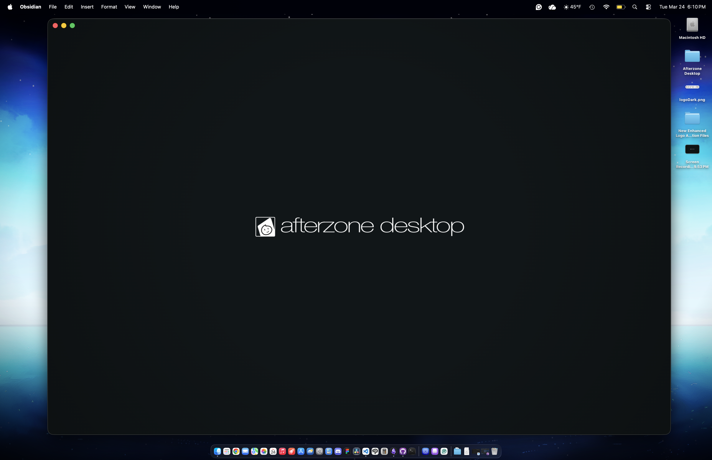

# <center>Splash Screen (for Obsidian) by Benjamin Fernandez</center>



# How To Use

Place the snippet in your ```.obsidian/snippets``` folder but before you enable this snippet, you need to modify the .css file by adjusting the logo image, duration, and also the animation delay. The reason is that due to the fact its a snippet, you might see the sequence late or has ended already.

## Changing the logo and its size
*By default, you will see no logo on both dark and light schemes on your vault. This can be changed by modifying the ```background-image: url()``` string for both schemes.*

To use your own logo or image, you need to encode your image into a Base64 image, as using a normal image from your local files won't work. *(Trust me, I tried doing that when working on this snippet.)*

It's recommended to use this site to convert and encode your image:
[Base64 Image Encoder](https://www.base64-image.de/)

On the snippet, locate the ```background-image: url()``` for both light and dark schemes:

Dark Scheme:
```
/* Logo Layer - Dark */
body.theme-dark::after {
    content: "";
    position: fixed;
    inset: 0;
    background-image: url(" ")      /* You need to provide your image in Base64 format data! */
    background-position: center;
    background-size: 200px;         /* If the logo image to small or big, adjust the size here! */

    opacity: 0;
    z-index: 9999;
    pointer-events: none;

    animation: splashLogoFade 2.5s cubic-bezier(.4,0,.2,1) forwards;
    animation-delay: 1s;            /* Adjust delay if needed or if your vault is loading a lot of plugins */
}
```

Light Scheme:
```
/* Logo Layer - Light */
body.theme-light::after {
    content: "";
    position: fixed;
    inset: 0;
    background-image: url(" ")      /* You need to provide your image in Base64 format data! */
    background-position: center;
    background-size: 200px;         /* If the logo image to small or big, adjust the size here! */

    opacity: 0;
    z-index: 9999;
    pointer-events: none;

    animation: splashLogoFade 2.5s cubic-bezier(.4,0,.2,1) forwards;
    animation-delay: 1s;            /* Adjust delay if needed or if your vault is loading a lot of plugins */
}
```

# Regarding customizing the whole snippet!
Since I had help by using AI responsibly to learn, verify, and test the code with no issues, although I may have no experience with CSS, you can customize the entire code of the snippet. If you planned to customize the entire snippet or forking my snippet, please make sure you credit me as the original creator of this snippet.
